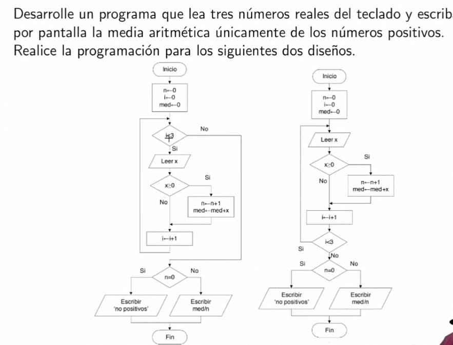
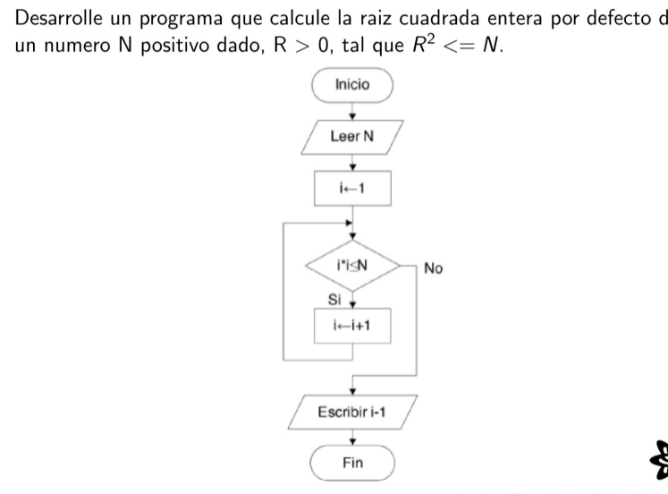

# Problemas de Programación

Dentro de esta carpeta se documentará y mostrará el código de los problemas dejados en clase.

### Problema 1


**Variables de entrada y salida:**
- i   = Número de ingresos y es una variable de control. 
- n   = Cantidad de números positivos.
- x   = Valor del número ingresado.
- med = El resultado de la media aritmética.

**Compilación y ejecución:**
```
 $ gcc -o Problema_1.out Problema_1.c
 $ ./Problema_1.out
 ```

 ### Problema 2


**Variables de entrada y salida:**
- i   = Número de ingresos y es una variable de control. 
- n   = Cantidad de números positivos.
- x   = Valor del número ingresado.
- med = El resultado de la media aritmética.
- max = Variable de salida que da el máximo de los números ingresados.
- min = Variable de salida que da el mínimo de los números ingresados.

**Compilación y ejecución:**
```
 $ gcc -o Problema_2 Problema_2.c
 $ ./Problema_2.out
 ```
 
 ### Problema 3


**Variables de entrada y salida:**
- n = Variable de entrada que guarda el número que ingresa el usuario. 
- r = Variable que va aumentando hasta que se cumple la condición del ciclo.

**Compilación y ejecución:**
```
 $ gcc -o Problema_3.out Problema_3.c
 $ ./Problema_3.out
 ```

  ### Problema 4


**Variables de entrada y salida:**

- N     = Variable de entrada que guarda el número ingresado por el usuario.
- i     = Contador que aumenta su valor para poder obtener el residuo de N con distintos números.
- primo = Condicional que ayuda a determinar si el número es primo o no. Su valor es 1 si el número es primo y 0 si no.


**Compilación y ejecución:**
```
 $ gcc -o Problema_4.out Problema_4.c
 $ ./Problema_4.out
 ```

   ### Problema 5


**Variables de entrada y salida:**
- N1    = Variable de entrada que guarda el límite inferior ingresado por el usuario.
- N2    = Variable de entrada que guarda el límite superior ingresado por el usuario.
- i     = Variable de conteo que va aumentando progresivamente desde N1 hasta N2.
- j     = Contador de la función primo que aumenta su valor para poder obtener el residuo de N con distintos números.
- N     = Variable de la función primo que actúa como límite superior para determinar si los números anteriores a él son primos o no.
- value = Condicional que ayuda a determinar si el número es primo o no. Su valor es 1 si el número es primo y 0 si no.

**Compilación y ejecución:**
```
 $ gcc -o Problema_5.out Problema_5.c
 $ ./Problema_5.out
 ```

   ### Problema 6


**Variables de entrada y salida:**
- M    = Almacena el número de vértices del polígono ingresado por el usuario.
- N    = Variable que representa la longitud del arreglo.
- i    = Contador de la sumatoria.
- fila = Variable para moverse entre las filas del arreglo.
- A    = Variable que almacena el resultado de la sumatoria a lo largo de la ejecución.

**Compilación y ejecución:**
```
 $ gcc -o Problema_6.out Problema_6.c
 $ ./Problema_6.out
 ```