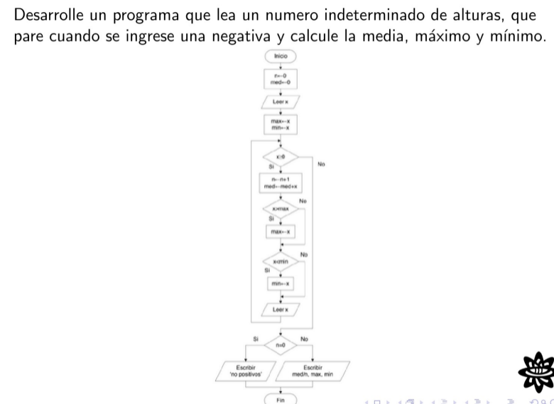

# Problemas de Programación

Dentro de esta carpeta se documentará y mostrará el código de los problemas dejados en clase.

### Problema 1

**Variables de entrada y salida:**
- i   = Número de ingresos y es una variable de control 
- n   = Cantidad de números positivos
- x   = Valor del número ingresado
- med = El resultado de la media aritmética

**Compilación y ejecución:**
```
 $ gcc -o Problema_1 Problema_1.c
 $ Problema_1
 ```

 ### Problema 2

**Variables de entrada y salida:**
- i   = Número de ingresos y es una variable de control 
- n   = Cantidad de números positivos
- x   = Valor del número ingresado
- med = El resultado de la media aritmética
- max = Variable de salida que da el máximo de los números ingresados
- min = Variable de salida que da el mínimo de los números ingresados

**Compilación y ejecución:**
```
 $ gcc -o Problema_2 Problema_2.c
 $ Problema_2
 ```
 ### Problema 3

**Variables de entrada y salida:**
- n = Variable de entrada que guarda el número que ingresa el usuario 
- r = Variable que va aumentando hasta que se cumple la condición del ciclo

**Compilación y ejecución:**
```
 $ gcc -o Problema_3 Problema_3.c
 $ Problema_3
 ```
