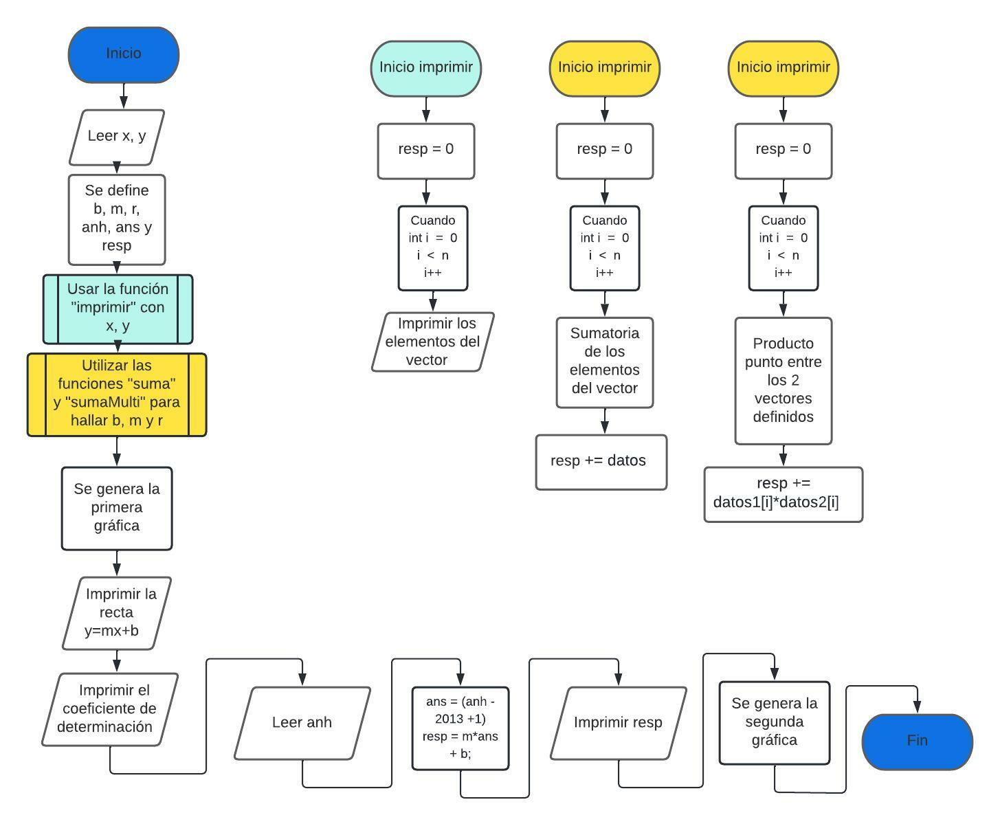

# Problemas del segundo parcial (201904140)

Dentro de esta carpeta se documentará y mostrará el código de los problemas del segundo examen parcial de Laboratorio de simulación.

### **Problema 1**

**Incisos**


**Diagrama de flujo**


**Variables de entrada y salida:**
- x   = Años de producción
- y   = Vector que almacena la información de los precios de cardamomo (en miles de quetzales) en los distintos años
- b   = Intercepto
- m   = Pendiente
- r   = Coeficiente de correlación

**Metodología:**
- Se divide el problema en 3 funciones para luego llamarlas durante el programa
- Se hace una función que imprima los datos de los vectores ingresados llamada "imprimir"
- Se crea una función que realiza la suma de los elementos de los vectores ingresados llamada "suma"
- Se hace una función que realiza el "producto punto" de los dos vectores ingresados. Esta se llama "sumaMulti"
- Se llama la función "imprimir" para presentar los valores de x y y.
- Se calcula el valor de m según la fórmula matemática. Para esto, se llaman las funciones "sumaMulti" y "suma"
- Se halla el valor de b usando las funciones "suma" y "sumaMulti"
- Se calcula el valor de r. De nuevo, se usan las funciones "suma" y "sumaMulti".

**Respuestas del problema**
- Recta que que mejor aproxima el crecimiento en las ganancias: y = 28.227352x + 602.714478
- Gráfica inicial de los datos 
- 
- Gráfica de y = 28.227352x + 602.714478 
- 
- La ganancia aproximadas utilizando el método de mínimos cuadrados es de Q884,988.00 mientras la estimación del gobierno es de Q920,100.00

**Compilación y ejecución:**
```
 $ gcc -o MinCuadrados MinCuadrados.c -lm
 $ ./MinCuadrados.out
 ```

 ### **Problema 2**

 **Incisos** 

**Diagrama de flujo**

**Variables de entrada y salida:**
- x0   = Estimación inicial de la raíz (variable de entrada)
- e    = Error tolerable en la obtención de la raíz (variable de entrada)
- N    = Número máximo de iteraciones (variable de entrada)
- Itr  = Contador de las iteraciones en el método numérico 
- f(x) = Función a la que se desea obtener las raíces
- g(x) = Derivada de la función f(x)
- f0   = f(x) valuada en 0 (f0 = f(0))
- g0   = g(x) valuada en 0 (g0 = g(0))
- x1   = Valor que se obtiene de la operación x0 - f0/g0
- f1   = f(x) valuada en x1 (f1 = f(x1))

**Metodología:**
1. Inicio
2. Se define f(x)
3. Se define la primera derivada de f(x) como g(x)
4. Se solicita la estimación inicial (x0), el error tolerable (e) y número máximo de iteraciones (N)
5. Se inicializa el contador Itr = 1
6. Si g(x0) = 0 entonces se imprime "Error matemático" y se dirige a (12). De lo contrario se direcciona a (7) 
7. Se calcula x1 = x0 - f(x0) / g(x0)
8. Se aumenta el contador Itr = Itr + 1
9. Si i >= N entonces se imprime "No convergente" y se dirige a (12), caso contrario se dirige a (10) 
10. Si |f(x1)| > e entonces se deja x0 = x1 y se dirige (6), caso contrario se dirige a (11)
11. Se imprime la raíz x1
12. Finaliza el programa

**Respuestas del problema**
- La raíz de la función f(x) = x + e^(x) es -0.567143
- Gráfica de la función f(x) = x + e^(x) 
- 
- Haciendo la comparación entre la gráfica de f(x) y el valor encontrado por el programa, se puede notar que ambos resultados son bastante parecidos


**Compilación y ejecución:**
```
 $ gcc -o Newt-Raph -lm Newt-Raph.c -lm
 $ ./Newt-Raph.out
 ```